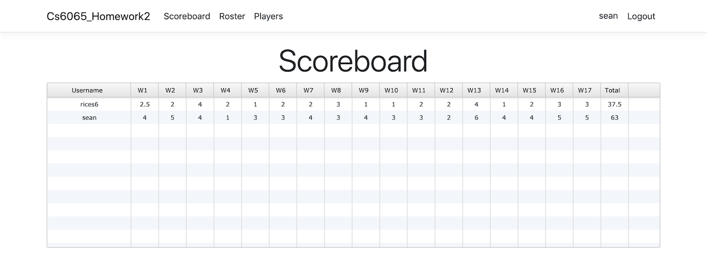
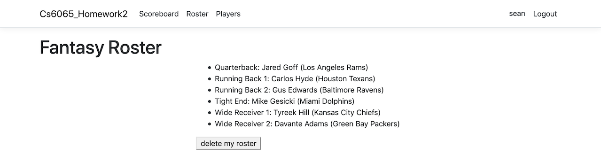
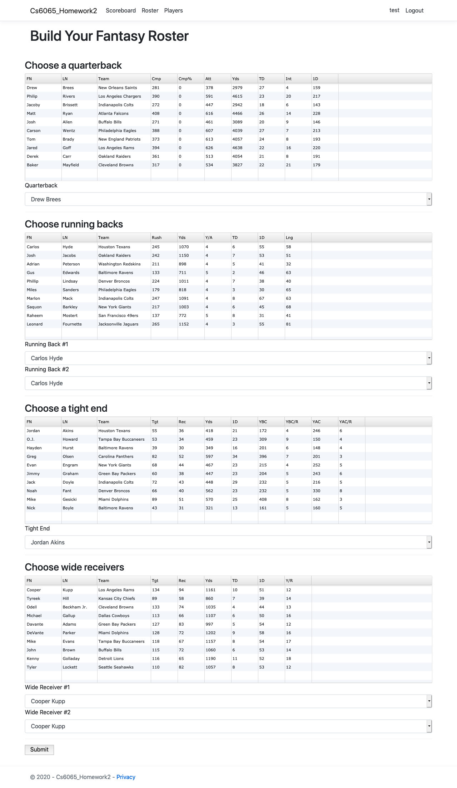

# cs6065_homework2

## overview

a basic fantasy football web application for the cloud, built with c#
and asp.net core.

## background

authors: sean rice & soondos mulla-ossman  
created for: cs6065, cloud computing at the university of cincinnati, fall 2020

## gallery

### home page / scoreboard

  

### viewing your roster

  

### building a roster

  

